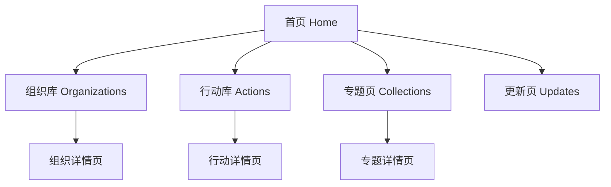

# 网站结构示意图

下面给出一个更简洁、适合当前阶段的网站结构示意。

## 1. 页面结构图



## 2. 首页线框图

```text
+------------------------------------------------------+
| 国际组织 AI 行动观察站                               |
| Tracking AI actions by international organizations   |
| [浏览组织] [浏览行动] [最近更新]                     |
+------------------------------------------------------+

+----------------+----------------+--------------------+
| 收录组织数      | 收录行动数      | 最近30天新增        |
+----------------+----------------+--------------------+

+------------------------------------------------------+
| 精选组织                                              |
| [UN/UNESCO] [OECD/GPAI] [EU AI Office] [CoE] [ASEAN] |
+------------------------------------------------------+

+------------------------------------------------------+
| 最新行动                                              |
| - 某国际组织发布新框架                               |
| - 某组织启动能力建设项目                             |
| - 某组织更新标准或工具                               |
+------------------------------------------------------+

+------------------------------------------------------+
| 专题 Collections                                      |
| [联合国 AI 行动] [区域组织 AI 治理] [AI 标准与工具]  |
+------------------------------------------------------+
```

## 3. 组织详情页线框图

```text
+------------------------------------------------------+
| 组织名称 / 缩写                                       |
| 类型 | 所属体系 | 总部 | 成立时间                      |
+------------------------------------------------------+

+------------------------------------------------------+
| 这个组织在 AI 上做什么                                |
| 一段 100-150 字摘要                                   |
+------------------------------------------------------+

+-----------------------------+------------------------+
| 代表性行动                   | 代表性文件/工具        |
| - action 1                  | - instrument 1         |
| - action 2                  | - instrument 2         |
| - action 3                  | - instrument 3         |
+-----------------------------+------------------------+

+------------------------------------------------------+
| 最近更新                                              |
| - 2026-06-01 ...                                      |
| - 2026-05-15 ...                                      |
+------------------------------------------------------+
```

## 4. 行动页线框图

```text
+------------------------------------------------------+
| 搜索框 [组织筛选] [行动类型] [议题] [时间] [区域]     |
+------------------------------------------------------+

+------------------------------------------------------+
| Action 卡片                                           |
| 标题                                                  |
| 发起组织：XXX                                         |
| 类型：framework / project / standard / event         |
| 时间：2026-05-10                                      |
| 摘要：这项行动做了什么                                |
| [查看详情] [官方来源]                                 |
+------------------------------------------------------+
```

## 5. 最小可用版本

如果先做 MVP，可以只保留：

```text
首页
├─ 组织库
│  └─ 组织详情
└─ 行动库
   └─ 行动详情
```

专题页和更新页可以先作为首页中的两个区块，不必马上做成复杂栏目。
